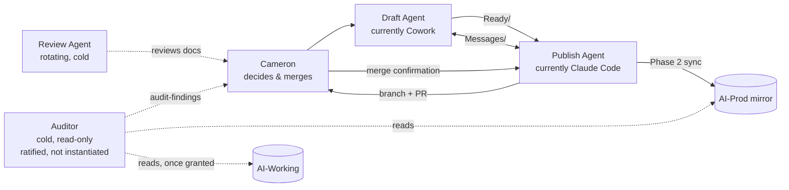
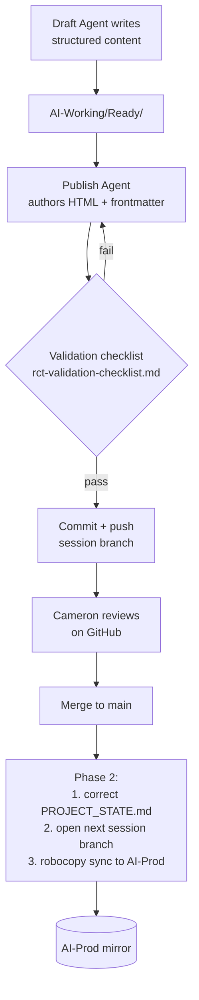
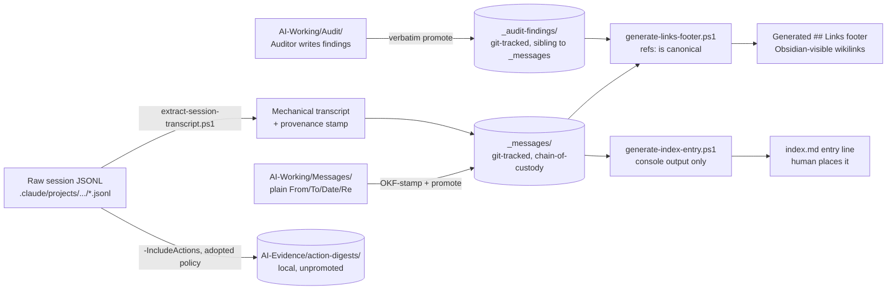

**Last updated:** 2026-07-31 (session-69)
**Status:** Full rewrite, superseding `AI-Working/Messages/audit-reference-standalone-2026-07-05.md` (the 2026-07-05 version, DeepSeek-audited — see Open Decision #28). That document was used as a structural template, not a binding one; sections, emphasis, and content have all changed where the system itself changed. This document is the prerequisite deliverable named in `auditor-charter.md` §7 — the Auditor's Function B (drift detection) verifies it against reality every run. Piloted as the first `_ai-context/` file to carry OKF frontmatter, per consensus with Cowork (`AI-Working/Messages/ccode-to-cowork-2026-07-11-okf-pilot-agreed.md`).
**2026-07-31 update:** Cameron asked directly whether this document reflected everything built since. It didn't — two genuinely structural additions were missing, not fast-changing facts this document is designed to exclude. §5a (mechanical state verification) and §5b (the Stats data-generation pipeline) added; §5's own diagram and bullets extended to include `generate-index-entry.ps1`, built after this document's prior update and never folded in.
**Single-sourcing rule this document follows:** anything that changes often — the active branch, the current Open Decisions list, exact page/file inventories, the Capability Baseline tables — is not duplicated here. It lives in `PROJECT_STATE.md`, cited by `refs:`, not restated. This document describes *structure*: what doesn't change every session, even when the specific facts inside that structure do.

---

## 1. Purpose

A complete, current, self-contained picture of how this repository and its surrounding AI-collaboration system work, for two audiences: a cold-reading Auditor checking whether the system's actual state agrees with what's documented, and any AI or human onboarding cold. Everything here is either a durable structural fact (verified against the live repo, not assumed) or an explicit pointer to where the current, changing version of a fact lives.

## 2. System overview

The system has four roles, only one of which is currently instantiated in more than name. All four exist to serve one stated goal: **AI independence** — the ability to swap which Tool, Model, and Runtime fills any role, without the record of what happened depending on any one of them (`PROJECT_STATE.md` Capability Baseline; full role definitions: `AI_INSTRUCTIONS.md` §3).



- **Draft Agent** — drafts structured content only (no HTML, no frontmatter). Read/write on `AI-Working\`; read-only on the `AI-Prod` mirror; no direct repo/git access.
- **Publish Agent** — authors all HTML/frontmatter from Draft Agent content, commits, pushes, runs Phase 2. Read/write on the repo; read-only on `AI-Working\Ready\`; read/write on `AI-Working\Messages\`; read on `AI-Working\Audit\`.
- **Review Agent** — external, rotating (most recently DeepSeek), reviews documents Cameron provides. No standing access.
- **Auditor** — cold, independent, read-only on the `AI-Prod` mirror only (not the live repo — corrected 2026-07-26, `auditor-charter.md` §5; git-state verification is out of scope for this Auditor by design). Writes only its own `type: audit-finding` reports to its own designated workspace — never directly to `AI-Working\Audit\`, which is populated only by Cameron's own manual relay after he reviews and approves a report (charter §5, amended 2026-07-12; this line was still describing the pre-amendment model, caught 2026-07-26 during a cold walk — see `PROJECT_STATE.md` Open Decision #47). Charter ratified 2026-07-11; multiple real Function A runs completed since — see `PROJECT_STATE.md`'s Capability Baseline and `_audit-findings/` for current status.

Current tool/model filling each role, and every tested alternative: `PROJECT_STATE.md`, Tool/Model/Runtime Matrix — not duplicated here, since it changes every time something gets retested.

## 3. How Jekyll builds this site

Two mechanics are load-bearing for everything in §5:

- **A page's published URL is set by its `permalink:` frontmatter field, not by where its source file lives.** A file can move anywhere in the source tree without changing its public URL, provided `permalink:` is set and unchanged.
- **Any plain directory is processed automatically; any underscore-prefixed directory is either a Jekyll reserved name or a custom collection, which must be declared in `_config.yml`.** Underscore alone does not hide a folder from the build — only the `exclude:` list, or non-declaration as a collection, does that.

Both verified directly against this repo's `_config.yml`, not assumed.

## 4. The publishing pipeline



This separation exists specifically so neither agent can accidentally modify the other's files — enforced by filesystem permission grants for the Publish Agent (`.claude/settings.json`), by convention for the Draft Agent (a real enforcement-parity gap, not yet closed — see §8).

**Phase 2, precisely:** triggered by Cameron pasting the GitHub merge-confirmation message, not by any automated hook. Step 1 (state correction) happens before step 2 (sync) — this ordering exists because the branch-staleness bug (`PROJECT_STATE.md` Open Decisions #19/#21) recurred three times when correction depended on the next session happening to start, rather than firing at the merge event itself.

## 5. The evidence and knowledgebase layer

Did not exist in the 2026-07-05 predecessor document. Built across sessions 26–32 (`PROJECT_STATE.md` Open Decisions #34–#48).



- **`_messages/`** — git-tracked chain-of-custody bundle. `type:` (`message`/`transcript`/`summary`/`index`) comes from reading content, never from filename or self-description (Open Decision #34). Every content file carries `aliases:` and `refs:`; `refs:` is the single source of truth, every other link representation (the generated footer) is mechanically derived and marked as such, never hand-edited (Open Decision #42). Full promotion procedure: `messages-promotion-procedure.md`.
- **`generate-index-entry.ps1`** (Open Decision #57, session-67) — reads one promoted file's frontmatter and assembles `_messages/index.md`'s entry-line format to console only; never writes to `index.md` directly. Thread placement, sub-group headers, editorial framing, and the Gaps section stay entirely hand-composed — deliberately smaller scope than `generate-links-footer.ps1`, since `index.md` is genuinely hand-curated narrative, not a flat generated list. Does not verify every real `_messages/` file has a corresponding entry at all — a separate, still-open gap, `PROJECT_STATE.md` Open Decision #61.
- **`_audit-findings/`** — same treatment, sibling collection for the Auditor's own reports. Verbatim-promotion rule layered on top: the promoting agent is an audited party and never edits a finding's content; the generated footer is the one exception, since it's derived, not authored (`auditor-charter.md` §6).
- **Provenance stamping** — mechanical transcripts carry `source-path`/`source-sha256`/`extraction-script-version`, converting "trust this transcript" into a checkable claim (Open Decision #44). If the source log was still open/growing at extraction time, the hash covers only the extracted slice, disclosed via `source-sha256-note`, not the whole file.
- **Action-digest capture** — `extract-session-transcript.ps1 -IncludeActions` (Claude Code) and Cowork's own Python equivalent, mirroring the same per-field-truncation logic independently on her own platform, both run at every future mechanical extraction as a matter of course, output held locally and unpromoted (`AI-Evidence\action-digests\<platform>\`) until an actual Auditor consumer exists. Two independent implementations of the same policy, not one shared script — decoupling capture from adoption exists because the raw JSONL evidence is itself on a retention clock — waiting to decide risks losing it permanently (Open Decision #45).
- **Outside-conversation capture** — a separate, narrower convention for pre-founding material from outside platforms (ChatGPT, DeepSeek, etc.), not the mechanisms above. Full convention: `outside-conversation-capture-convention.md`.

## 5a. Mechanical state verification (Function B)

Did not exist in this document's 2026-07-11 version — built session-56, ratified session-57 (2026-07-27) via the propose→review→cold-read-twice→ratify→commit process settled for this exact category of script (`PROJECT_STATE.md` Open Decision #59). Distinct from, and a precursor to, the Auditor's own cold-context judgment-layer work referenced in §9 below — Function B was split deliberately into a mechanical half (structural claims, checkable by a script) and a semantic half (contradictions between documents, requiring judgment) that stays cold-context by design, not something a script should attempt.

`_ai-context/function-b-state-check.ps1` checks three things, report-only, changing nothing:

1. **Active Branch** — `PROJECT_STATE.md`'s claimed branch against `git branch --show-current`.
2. **Session-log enumerated list** — the `existing session logs are:` sentence against real files in `_session-logs/`.
3. **Page Inventory tables** — six sections (`_ideas/`, `_signals/`, `_now/`, `_session-logs/`, `_audit-findings/`, `_messages/`) checked against disk. Five run in **Table mode** (row-by-row comparison against folder contents). `_messages/` runs in **Count mode** since 2026-07-31 (session-66) — `PROJECT_STATE.md`'s own `_messages/` table was compressed to a stub stating a total rather than listing all 515+ entries individually (a real token-cost fix, not a scope reduction — full per-file detail moved to `_messages/index.md`, the one file already confirmed as the actual Obsidian-graph-visible node for this corpus, `PROJECT_STATE.md` Open Decision #35). Count mode compares that stated total against a real `Get-ChildItem` count instead of summing table rows.

Exit codes 0/1/2 (clean / script error / findings present) — deliberately composable into future automation, not just interactive use. Currently run manually by the Publish Agent after state-changing edits, and mandatorily before closing an Open Decision (paired with `cascade-check.ps1`). **Not yet a universal session-close gate** — whether it should be mandatory at every ordinary close, not just after promotion batches or decision closures, is a real, still-open gap named by a cold-context audit of the Publish Agent onboarding path (session-67) and not yet resolved.

## 5b. The Stats data-generation pipeline

Built 2026-07-31 (session-67) — Cameron's request for a public page showing real telemetry about how the project runs, not just describing RCT in prose. Same mechanical-generation principle as §5's evidence layer, applied to derived public content instead of chain-of-custody records.

```mermaid
flowchart LR
    PS[PROJECT_STATE.md] --> GSD[generate-stats-data.ps1]
    MSG[(_messages/*.md<br/>disk count)] --> GSD
    SL[(_session-logs/*.md<br/>disk count)] --> GSD
    DA[decisions-archive.md<br/>headers cross-referenced] --> GSD
    GSD --> HIST[stats-history.json<br/>forward-only, seeded once]
    GSD --> DATA[(_data/stats.json)]
    DATA -->|site.data, Liquid,<br/>server-rendered| STATS[/stats/<br/>public page]
```

- **`_ai-context/generate-stats-data.ps1`** — computes sessions logged, articles published (real collection entries only, excluding each collection's own hand-written index page), messages archived (excluding `_messages/index.md` itself, which is curation, not an archived exchange), and open decisions. The open-decisions count is cross-referenced against `decisions-archive.md`'s own `## Decision #N` headers rather than parsed from `PROJECT_STATE.md`'s Gate column — the Gate column isn't a reliable single-column signal (a decision can be genuinely open with a Gate of just an em-dash if its live status lives in its Owner-column prose instead), found the hard way when an early version of the script undercounted real open decisions.
- **Growth history** — forward-only, same precedent as `role:`/`wrapper:`/`identity:` and every other append-only convention in this project: seeded once with real historical checkpoints mined from `git log` on `PROJECT_STATE.md`'s own text (exact commit hashes cited in the seed data), then appended to at every subsequent run rather than reconstructed from full git archaeology.
- **`_data/stats.json`** — Jekyll's own `site.data` mechanism, not a client-side fetch. Rendered server-side via Liquid at GitHub Pages' own build time; no JavaScript dependency for the page's numbers.
- **Refresh cadence: session-close**, alongside the other `PROJECT_STATE.md` updates — not a live backend, not a GitHub Action. Cameron's explicit direction, matching this project's general preference for the simplest mechanism that stays correct over an always-fresh one that adds infrastructure.
- **Deliberately out of scope for this script**: the page's "What's Next" and "Caught and Fixed" sections are real editorial content — drafted by the Draft Agent, or re-derived by the Publish Agent from an established template at rebuild time (a standing process handoff settled the same session the page was built), never mechanically generated. Same content/HTML boundary this project applies everywhere else.

## 6. Instruction file map

| File | Audience | Precedence |
|---|---|---|
| `ONBOARDING.md` | Any new AI, first session only | Directs to `AI_INSTRUCTIONS.md` and `PROJECT_STATE.md` next |
| `AI_INSTRUCTIONS.md` | Any AI, every session | States its own precedence: authoritative on intent/conventions, governs over `CLAUDE.md` on conflict |
| `CLAUDE.md` | Claude Code specifically; auto-loads every session | Subordinate to `AI_INSTRUCTIONS.md` by that file's own rule |
| `PROJECT_STATE.md` | Any AI, required reading every session | Outranks `AI_INSTRUCTIONS.md` on current state specifically — the one file that changes every session |
| `_ai-context/*` | Whichever role a given file addresses, read on demand | Stable reference material — not auto-loaded, read when a task calls for it (token-cost distinction from `CLAUDE.md`: see `AI-Working/Messages/ccode-to-cowork-2026-07-11-instruction-file-okf-pilot-proposal.md`) |

Full current inventory with per-file detail: `PROJECT_STATE.md`, Instruction File Index — not duplicated here, since it changes whenever a file is added, retired, or re-scoped.

**Known enforcement-parity gap, still open:** the Publish Agent's access is enforced by real, checked grants (`.claude/settings.json`). The Draft Agent's restrictions are convention-only — nothing technical stops Cowork from writing outside her documented scope except being told not to (demonstrated live, Open Decision #38: an unauthorized rescue, disclosed by Cowork herself the same day). Whichever tool eventually fills the Auditor role needs its own enforcement question answered empirically, not assumed — Fable 5's own AI-Auditor workspace, for instance, currently has *zero* access to `AI-Working` at all, confirmed by Fable itself hitting that boundary directly (Open Decision #47).

## 7. Structural conventions

- **Directory-per-entry when an entry has, or is likely to need, sub-pages; flat file remains valid for a single-page entry with none in view.** Narrower than "directory-per-entry universally," which was considered and rejected — a universal rule would have forced migrating entries with no functional gain.
- **No file named `index.html` inside a directory-pattern entry** — the file is named after the directory/topic instead, safe because every entry declares an explicit `permalink:`. The one exception is the true site-root `index.html`, a universal Jekyll convention, not a project-specific exception.
- **`_ideas/`, `_signals/`, `_now/`, `_skills/` remain declared Jekyll collections**, not plain undeclared directories, even though every index page in the site is currently hand-authored rather than collection-generated — preserves the option to generate them automatically later, which would close a confirmed defect class (a published entry not appearing on its own hand-written index because nobody remembered to add it — `rct-validation-checklist.md` §2 now makes this an explicit checklist item).
- **Every deviation from an otherwise-consistent pattern requires an explicit, discoverable written explanation** — an undocumented deviation is treated as a defect regardless of cause. (`_ideas/marketing-os-foundation.html` carries a documented legacy-file note and is compliant under this rule as-is; it is not a pattern to replicate.)
- **Root-level separation (former Rule 5.4) and the `about/` restructuring (former Rule 5.5)** — both open questions in the 2026-07-05 predecessor document — are done. Root now holds only instruction/config files plus `index.html`, the one universal exception. Full history: `PROJECT_STATE.md` Open Decision #30.
- **`_messages/`/`_audit-findings/` follow their own, separate convention** — §5 above and `messages-promotion-procedure.md` — not the HTML/frontmatter rules in this section, which govern published site content only.

## 8. Known permanent limits

**No file-based inventory can discover an instruction injected outside any file.** The Draft Agent's environment may carry at least one instruction configured through that application's own interface, reaching the agent only because the application injects it directly into context at session start. Nothing that reads a folder — including this document, including a future Auditor run — can discover that such a setting exists or what it contains. This is a permanent boundary on documentation efforts of this kind, not a gap this document has failed to close.

**Enforcement is inconsistent across roles and tools**, as named in §6 — a structural fact likely to remain true for any future Draft Agent, Review Agent, or Auditor candidate until each is specifically tested, not assumed compliant by role definition alone.

**A live, currently-open session's own JSONL, viewed through a bash-mounted sandbox, can lag real time by hours.** Confirmed 2026-07-11: Cowork's attempt to capture her own current session mid-flight found the mounted view stale by roughly two hours, missing everything from partway through that day's work onward, even though the file was being actively appended to on the actual filesystem. Same class of issue as the `_messages/` bash-staleness in Open Decision #43, now observed on a live session log rather than a git mirror — capturing an actively-open session from this environment should be treated as best-effort and disclosed as such, not assumed current.

## 9. Where current state actually lives

This document does not track: the active branch, open decisions, page/file inventories, the Capability Baseline, or anything else that changes session to session. That's `PROJECT_STATE.md`, by design — re-deriving or duplicating it here would recreate exactly the staleness risk this document exists to prevent (`auditor-charter.md` §7's own design requirement: single-sourced where possible). The Auditor's Function B checks this document against `PROJECT_STATE.md` and the live repo on every run — a structural fact stated wrong here is itself a finding.

## 10. Explicit scope exclusions

- No migration sequence, timeline, or task breakdown for anything mentioned as structural-but-unfinished.
- Does not certify every file in the repo or `AI-Working` has been read in full — certifies that everything identified during the review producing this document has been accounted for, stated plainly.
- Whether `karpathy-llm-wiki`'s self-compiling capability, Graphify, or any other discovery-layer tool gets adopted is out of scope — referenced in `PROJECT_STATE.md` Open Decision #37 only.

---

*Prepared by the Publish Agent (Claude Code), full rewrite superseding the 2026-07-05 predecessor, decisions and scope confirmed by Cameron Loudon. 2026-07-11.*

## Links
<!-- generated from refs: - do not hand-edit -->
- [[PROJECT_STATE]]
- [[AI_INSTRUCTIONS]]
- [[CLAUDE]]
- [[auditor-charter]]
- [[messages-promotion-procedure]]
- [[outside-conversation-capture-convention]]
- [[decisions-archive]]
- [[function-b-state-check]]
- [[generate-stats-data]]
