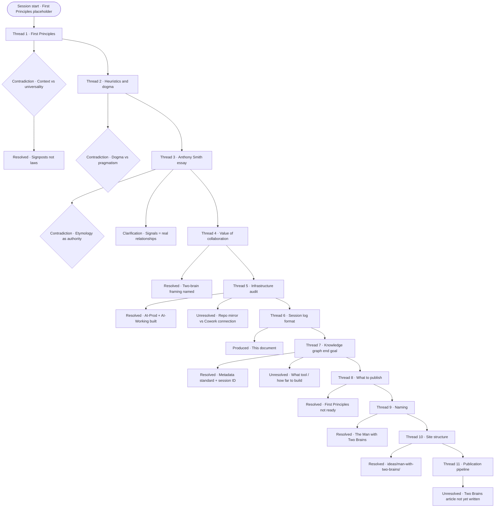

# Session Audit Log — 2026-06-10-001

---

## Metadata

| Field | Value |
|-------|-------|
| Session ID | 2026-06-10-001 |
| Date | 2026-06-10 |
| Participants | Cameron Loudon + Claude (Anthropic) |
| Model | claude-sonnet-4-6 |
| Platform | Claude Cowork |
| Duration | ~6 hours (estimated) |
| Threads | 11 |
| Contradictions named | 5 |
| Resolved | 8 |
| Unresolved | 3 |
| Files produced | 7 |
| Memory files saved | 3 |

**Tags:** `#first-principles` `#strategy` `#heuristics` `#signals` `#infrastructure` `#session-log` `#two-brain-audit` `#knowledge-graph` `#rct` `#mermaid` `#man-with-two-brains`

**Documents touched:**
- `AI-Working/Projects/First-Principles/first-principles.html` (created)
- `AI-Working/Projects/Session-Log-Format/session-log-format.html` (created — superseded by Two Brains)
- `AI-Working/Projects/Infrastructure/folder-infrastructure-explanation.md` (created)
- `AI-Working/Projects/Signals/` (populated)
- `AI-Prod/` (created — full repo mirror with clean .md versions)
- `AI-Working/session-2026-06-10-001.md` (this file)
- `repo-structure.txt` (produced via Claude Code)

**Prior sessions referenced:** None (first session in this format)

**Published pages connected:** None yet — all artifacts pending review and Claude Code push

---

## How This Session Started

Cameron arrived with First Principles as a folder placeholder — a possible topic for the Ideas section of his GitHub site. He wanted a broad discussion, not answers. He explicitly said he was seeking understanding and wanted to acknowledge contradictions as they emerged.

---

## Thread 1 — First Principles as a Concept

**Where it went:**
We discussed first principles not as laws but as signposts — Cameron's framing, which resolved an earlier tension about whether something that only holds in certain contexts qualifies as a first principle at all. The reframe: utility matters more than philosophical purity. Signposts guide; they don't have to be universal truths.

**Contradictions named:**
- "Context matters" can become a rationalisation for ignoring inconvenient principles rather than genuinely interrogating them
- The question Claude asked — "is a context-dependent principle actually a first principle?" — was identified as a trap: it privileges philosophical purity over practical utility, which contradicts the whole discussion

**Unresolved:**
The thinking is genuinely unfinished. The title "First Principles" is a placeholder — the final piece will be named when the thinking is complete. Content sits in AI-Working pending future sessions.

---

## Thread 2 — MecLabs, Heuristics, and Dogma

**Where it went:**
MecLabs probability of conversion used as a case study for what a good heuristic actually does — it's a taxonomy that forces you to think about the right things, not a formula. Cameron's point: considered answers beat random, even if the heuristic isn't perfect.

**Contradictions named:**
- Any sufficiently useful framework eventually gets cargo-culted — the tool designed to provoke thinking becomes a substitute for thinking
- Cameron named this as dogma and rejected it, but also acknowledged that sometimes the work just needs to get done

---

## Thread 3 — Anthony Smith's Strategy Piece

**Where it went:**
Cameron shared Anthony Smith's essay on university strategic plans not being strategies. Discussed as an illustration of the signpost principle — the plan/strategy distinction is an argument about what the real first principles of competitive positioning are.

**Contradictions named:**
- The piece appeals to etymology (strategos) to establish what strategy "really means" — which is itself a first principles move
- Universities' rejection of competitive framing isn't irrational — but the QUT example is empirical evidence that the relational framing works in practice

**Clarification from Cameron:**
Anthony Smith is a Signal — a person who directly shaped Cameron through a real professional relationship (20+ years, three universities). Not a thinker Cameron admires from a distance. Recorded in memory.

---

## Thread 4 — The Value of This Collaboration

**Where it went:**
Cameron asked directly where the value comes from. His description: "like having a conversation with myself out loud." Claude's honest answer: that's accurate and not a criticism. What Claude brings is friction without ego, structure from mess, and memory within a session.

**The honest limit named:**
Claude cannot surprise Cameron with domain knowledge he doesn't have, or tell him when he's genuinely wrong rather than just inconsistent.

---

## Thread 5 — Infrastructure and Folder Structure

**Where it went:**
Full audit of Cameron's digital infrastructure. Site traversal completed. Repo structure extracted. Local folder audit completed.

**Decisions made and implemented:**
- New structure: `C:\Users\camer\Documents\AI\` as root with two subfolders
- `AI-Prod\` — repo mirror, all key content as clean .md (completed)
- `AI-Working\` — thinking and drafting space (completed)
- Growthband outbound skills — removed (resolved)
- Signals — populated in both AI-Prod and AI-Working (resolved)

**Unresolved:**
Direct Cowork connection to GitHub repo folder still a possible alternative to AI-Prod sync.

---

## Thread 6 — Session Log Format

**Where it went:**
Cameron said a collaboration note doesn't cut it. An audit log is the right frame — it captures the reasoning, not just the conclusion. This document is the first implementation.

---

## Thread 7 — Two-Brain Visualisation and Knowledge Graph

**Where it went:**
Mermaid diagrams identified as zero-infrastructure proof of concept. SVG rendered as demonstration. Bigger idea named: a knowledge graph with narrative as possible end goal.

**Key principle established:**
Design session logs as if they will become nodes in a graph. Capture metadata now rather than retrofitting later. Session ID format decided: `YYYY-MM-DD-NNN`.

**Unresolved:**
What tool / how far to build — deferred until more sessions accumulate.

---

## Thread 8 — Naming the Publishable Artifacts

**Where it went:**
Review of what today produced and what was actually ready to publish. Key correction: First Principles conversation was genuinely unfinished and the title is a placeholder. Publishing it prematurely would be misleading.

**Decision:** First Principles stays in AI-Working. Not ready to publish.

---

## Thread 9 — "The Man with Two Brains"

**Where it went:**
The session log format piece needed a better name than "Session Log + Two-Brain Audit Format" — dry, internal, doesn't communicate value to a site visitor.

Cameron suggested "The Man with Two Brains" — a reference to the 1983 Steve Martin / Carl Reiner film. Dr. Michael Hfuhruhurr, a neurosurgeon who falls in love with a disembodied brain he communicates with telepathically. Two minds collaborating across different forms to think and produce something neither could alone.

The metaphor is precise: Cameron is the neurosurgeon — domain knowledge, judgment, accountability, a body in the world. Claude is the brain in the jar — pattern recognition, structure, friction without ego, existing in a different form.

**Decision:** The Ideas entry will be titled "The Man with Two Brains." The film is an explicit reference and the metaphor explains the concept more vividly than any clinical title.

---

## Thread 10 — Structure of the Two Brains Entry

**Where it went:**
First Principles content now has a home as a worked example under the Two Brains piece rather than a standalone entry.

**Site structure decided:**
```
_ideas/
└── man-with-two-brains/
    ├── index.html              ← the main Two Brains piece
    └── first-principles.html  ← worked example, placeholder title
```

**URLs:**
- `cameronloudon.github.io/ideas/man-with-two-brains/`
- `cameronloudon.github.io/ideas/man-with-two-brains/first-principles/`

**Key note:** "first-principles.html" is a placeholder title. When the thinking is finished and the piece is promoted to a top-level Ideas entry, it will be renamed. The right name will emerge from the content when the content is ready.

**When promoted:** The subfolder version becomes a redirect or archive. The Two Brains piece updates its link to point to the new top-level entry.

---

## Thread 11 — Publication Pipeline

**Where it went:**
Two-step process agreed:

**Step 1 (Cowork):** Update session log → write Two Brains piece → Cameron reviews both

**Step 2 (Claude Code — one prompt):**
- Create `_ideas/man-with-two-brains/` folder
- Add `index.html` (Two Brains main piece)
- Add `first-principles.html` (worked example)
- Add `_session-logs/session-2026-06-10-001.md`
- Update `_ideas/index.html` with new entry
- Update `approach.html` to reference session log format
- Sync AI-Prod to match

**Unresolved:** Two Brains article not yet written — next step in this session.

---

## Artifacts Produced This Session

| Artifact | Status | Location |
|----------|--------|----------|
| session-2026-06-10-001.md | Complete | AI-Working/ |
| folder-infrastructure-explanation.md | Complete | AI-Working/Projects/Infrastructure/ |
| first-principles.html (worked example) | Draft | AI-Working/Projects/First-Principles/ |
| Session-Log-Format article | Superseded by Two Brains | AI-Working/Projects/Session-Log-Format/ |
| AI-Prod repo mirror | Complete | AI-Prod/ |
| The Man with Two Brains — index.html | Not yet written | — |

---

## Session Diagram



---

*Session conducted under the Radical Collaboration Transparency framework.*
*Model: claude-sonnet-4-6 · Session ID: 2026-06-10-001 · Platform: Claude Cowork*
*Reviewed and approved by Cameron Loudon.*
