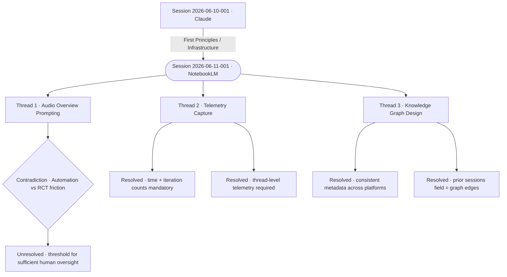

# Session Audit Log — 2026-06-11-001

---

## Metadata

| Field | Value |
|-------|-------|
| Session ID | 2026-06-11-001 |
| Date | 2026-06-11 |
| Participants | Cameron Loudon + NotebookLM |
| Model | NotebookLM (Gemini Pro variant) |
| Platform | NotebookLM |
| Duration | ~2 hours (estimated) |
| Threads | 3 |
| Contradictions named | 1 |
| Resolved | 2 |
| Unresolved | 1 |
| Files produced | 3 |

**Tags:** `#notebooklm` `#audio-overview` `#telemetry` `#knowledge-graph` `#rct` `#session-log` `#two-brain-audit`

**Documents touched:**
- Session Audit Log (Revised)
- Audio Overview Prompt
- Telemetry Capture Standard

**Artifacts produced:**
- `The Messy Middle.mp3` — NotebookLM audio overview output (AI-Working/Projects/Man-with-Two-Brains/)

**Prior sessions referenced:** Session 2026-06-10-001 (The Claude Session)

**Published pages connected:** None yet — pending review

---

## Session Overview: The Shift in Collaboration

This session marks a tactical pivot from the high-level philosophical architecture established in Session 2026-06-10-001. While the previous collaboration with Claude (Anthropic) focused on defining "First Principles" and the "Man with Two Brains" metaphor, today's session uses NotebookLM to bridge the gap between abstract framing and technical implementation.

If Claude is the "brain in the jar" — a source of friction without ego and deep pattern recognition — NotebookLM acts as the "tethered librarian." It provides a tighter, source-grounded synthesis that allows for the strategic design of prompts and the formalisation of telemetry. This session explores how we capture the "how" of creation when the AI is anchored to a specific corpus of data rather than the open-ended reasoning of a general LLM.

---

## Thread 1 — Strategic Design of Audio Overview Prompt

**Where it went:**
This line of inquiry focused on the transition from generic drafting to the strategic design of prompts, specifically leveraging NotebookLM's native Audio Overview capabilities. The goal was to move beyond "one-click" automated summaries and toward a structured prompt that forces the model to respect the RCT requirements. We explored how to structure input so the resulting audio output reflects the nuances of the source material rather than smoothing over contradictions.

**Contradictions named:**
- **Automation vs. RCT Cognitive Investment (Unresolved):** There is a fundamental tension between the convenience of automated audio generation and the RCT requirement for human-in-the-loop friction. Cameron identified that a one-click summary risks bypassing the cognitive investment that serves as proof of value in the Two Brains framework. If the human is not actively wrestling with the synthesis, the output lacks the provenance required for a genuine RCT artifact.

**Unresolved:**
The threshold for "sufficient human oversight" in automated media generation remains undefined.

---

## Thread 2 — Creation Telemetry and Provenance

**Where it went:**
Building on the decision in Thread 5 of Session 2026-06-10-001, this thread codified the requirements for Creation Telemetry. We established that the value of an artifact is inextricably linked to the history of its creation. The discussion moved from the philosophy of showing one's working to the standardisation of what data must be captured to prove collaboration took place.

**Decisions made:**
- Time-spent and iteration-counts are now mandatory metrics for any RCT log. These are not just administrative data points — they are the empirical evidence of Cameron's presence in the creative process.
- Telemetry must be captured at the thread level to ensure the non-linear, recursive nature of the thinking session is preserved.

---

## Thread 3 — Visualising Session Nodes in a Knowledge Graph

**Where it went:**
This thread expanded on the "Where This Is Going" section of Session 2026-06-10-001. We discussed the transition from static, isolated Markdown files to a Narrative Knowledge Graph. By treating every session log as a machine-readable node, we can begin to map the edges — the relationships where one decision (e.g., the folder structure defined with Claude) informs a later technical standard (e.g., the telemetry capture in NotebookLM).

**Decisions made:**
- Metadata headers must remain strictly consistent across different AI platforms (Claude, NotebookLM, etc.) to ensure graph traversability.
- The "Prior sessions referenced" field is the primary mechanism for establishing edges between evolving concepts.

---

## Comparison: NotebookLM vs. Claude (Anthropic)

| Feature | Claude (Sonnet 4.6) | NotebookLM |
|---------|---------------------|------------|
| Metaphor | "Brain in a jar" | "Tethered Librarian" |
| Primary Value | Ego-free structural feedback; philosophical friction | Source-grounded synthesis; strategic tool design |
| Interaction Style | Non-linear, recursive conversational friction | Grounded, evidentiary synthesis of provided context |
| RCT Friction | High — demands constant interrogation of principles | Moderate — risk of passive acceptance of automated summaries |

---

## Artifacts Produced This Session

| Artifact | Status | Location |
|----------|--------|----------|
| session-2026-06-11-001.md | Complete | AI-Working/ |
| The Messy Middle.mp3 | Complete | AI-Working/Projects/Man-with-Two-Brains/ |
| Audio Overview Prompt | Draft | AI-Working/Projects/Prompt-Design/ |
| Telemetry Capture Standard | In Progress | AI-Working/Projects/RCT/ |

---

## Session Diagram

---

  
🤝 <strong>Collaboration Note</strong>

  
This session log was developed in a strategic thinking session with NotebookLM.

  
Model: NotebookLM (Gemini Pro variant) · Session: 2026-06-11-001 · Platform: NotebookLM · Duration: ~2 hours

  
NotebookLM provided source-grounded synthesis to translate the "Two Brains" philosophy into a technical Telemetry Capture Standard. Cameron Loudon provided the strategic requirements and identified the core tension regarding the risk of automation-induced cognitive laziness. The "Tethered Librarian" metaphor was a collaborative breakthrough distinguishing NotebookLM's utility from the structural friction provided by Claude.

  
Reviewed and approved by Cameron Loudon. Part of the <a href="/approach/">Radical Collaboration Transparency</a> framework.

*Session conducted under the Radical Collaboration Transparency framework.*
*Model: NotebookLM · Session ID: 2026-06-11-001 · Platform: NotebookLM*
*Reviewed and approved by Cameron Loudon.*
