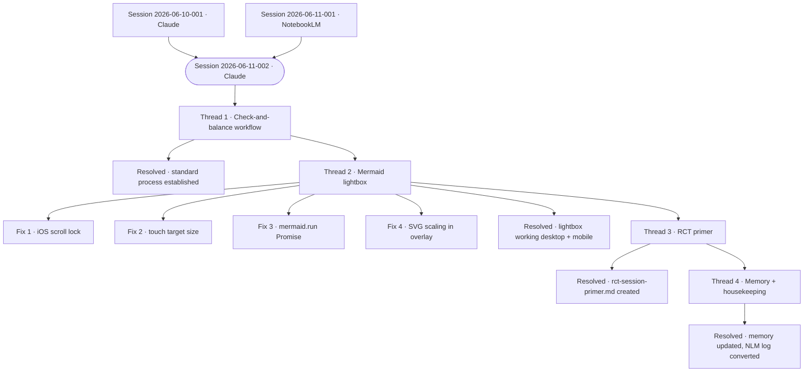

# Session Audit Log — 2026-06-11-002

---

## Metadata

| Field | Value |
|-------|-------|
| Session ID | 2026-06-11-002 |
| Date | 2026-06-11 |
| Participants | Cameron Loudon + Claude (Anthropic) |
| Model | claude-sonnet-4-6 |
| Platform | Claude Cowork |
| Duration | ~2 hours (estimated) |
| Threads | 4 |
| Contradictions named | 0 |
| Resolved | 4 |
| Unresolved | 0 |
| Files produced | 2 |

**Tags:** `#check-and-balance` `#mermaid` `#lightbox` `#rct` `#session-log` `#workflow` `#memory` `#claude-code`

**Documents touched:**
- `AI-Prod/_layouts/default.html` — lightbox implementation + SVG scaling fix
- `AI-Working/rct-session-primer.md` — created
- `memory/project-folder-structure.md` — updated
- `memory/project-rct-framework.md` — created
- `memory/feedback-check-and-balance.md` — created
- `memory/MEMORY.md` — updated

**Prior sessions referenced:** Session 2026-06-10-001, Session 2026-06-11-001

**Published pages connected:** None — `_layouts/default.html` change is live via session-2 branch

---

## Thread 1 — Check-and-Balance Workflow Established

**Where it went:**
Carried forward from the end of Session 2026-06-10-001. Cameron formalised a new process for technical implementations: Claude and Claude Code generate solutions independently, each reviews the other's solution, Cameron decides. The trigger was the Mermaid lightbox problem where both independently reached identical diagnoses — confirming the pattern had genuine value.

**Decision made:**
The check-and-balance process is now the standard approach for any non-trivial technical implementation. Cameron does not have the technical background to verify solutions independently — independent parallel generation provides that verification.

---

## Thread 2 — Mermaid Lightbox Implementation

**Where it went:**
Applied the check-and-balance process in its first formal use. Claude generated a lightbox solution. Cameron took the same problem to Claude Code independently. Claude Code's review identified three valid issues not caught in Claude's original solution:

1. **Background scroll not locked on iOS Safari** — fixed with `document.body.style.overflow = 'hidden'`
2. **Close button touch target too small** — increased to `2.75rem` (44px minimum)
3. **`setTimeout(1000)` unreliable** — replaced with `mermaid.run()` Promise, eliminating the race condition entirely

All three fixes incorporated. Implementation committed to `session-2` branch.

**Second fix:** SVG inside lightbox rendered at original small size because Mermaid sets explicit width/height attributes on the SVG. Fixed with CSS override in `.mermaid-overlay-content svg`.

**Resolved:** Lightbox working on desktop. Mobile scroll lock in place. SVG scales to fill overlay.

---

## Thread 3 — RCT Session Primer Created

**Where it went:**
Cameron identified a gap: when working with other AIs (NotebookLM, other Claude sessions, etc.) there was no portable document to establish the RCT framework and session capture requirements at the start of a session. 

**Decision made:**
Created `AI-Working/rct-session-primer.md` — a single paste-ready document that briefs any AI on RCT and instructs it on session log format, collaboration note standard, session ID convention, Mermaid diagram requirements, and file format preferences. Written to work across any AI, not Claude-specific.

**One correction made:** Removed the "Where Files Live" section (AI-Working/AI-Prod folder structure) — another AI has no access to Cameron's local folders and no business knowing about them. That section was for Cowork only.

---

## Thread 4 — Memory and Housekeeping

**Where it went:**
Memory audit revealed the folder structure entry was stale — it described the plan from Session 2026-06-10-001 before it was implemented, with incorrect paths. Updated.

Three new memory files created:
- `project-folder-structure.md` — corrected to reflect actual implemented structure
- `project-rct-framework.md` — RCT framework, session log format, Mermaid setup, primer location
- `feedback-check-and-balance.md` — check-and-balance workflow for future sessions

NotebookLM session log (`2026-06-11-001`) discovered in AI-Working/Projects/Man-with-Two-Brains/ as a `.txt` file. Converted to `.md` with Jekyll frontmatter and moved to correct location at AI-Working root. `The Messy Middle.mp3` identified as the NotebookLM audio overview artifact from that session.

---

## Artifacts Produced This Session

| Artifact | Status | Location |
|----------|--------|----------|
| session-2026-06-11-002.md | Complete | AI-Working/ |
| rct-session-primer.md | Complete | AI-Working/ |
| default.html (lightbox) | Live | AI-Prod/_layouts/ + session-2 branch |

---

## Session Diagram

---

  
🤝 <strong>Collaboration Note</strong>

  
This session log was developed in a working session with Claude (Anthropic).

  
Model: claude-sonnet-4-6 · Session: 2026-06-11-002 · Platform: Claude Cowork · Duration: ~2 hours

  
Claude drafted the lightbox implementation, generated the RCT primer, and managed all file operations. Cameron identified the check-and-balance workflow requirement, caught the "Where Files Live" section as inappropriate for a cross-AI document, and made all decisions on scope and approach. The three lightbox fixes were identified by Claude Code independently — not by Claude.

  
Reviewed and approved by Cameron Loudon. Part of the <a href="/approach/">Radical Collaboration Transparency</a> framework.

  
<a href="/session-logs/session-2026-06-11-002/">View session audit log →</a>

*Session conducted under the Radical Collaboration Transparency framework.*
*Model: claude-sonnet-4-6 · Session ID: 2026-06-11-002 · Platform: Claude Cowork*
*Reviewed and approved by Cameron Loudon.*
