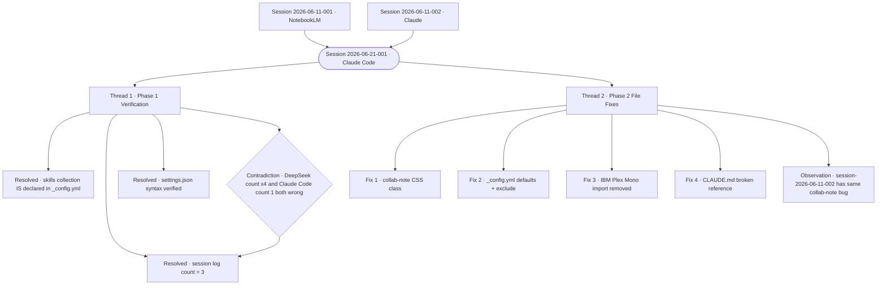

# Session Audit Log — 2026-06-21-001

---

## Metadata

| Field | Value |
|-------|-------|
| Session ID | 2026-06-21-001 |
| Date | 2026-06-21 |
| Participants | Cameron Loudon + Claude Code (Anthropic) |
| Model | claude-sonnet-4-6 |
| Platform | Claude Code |
| Duration | ~30 minutes |
| Threads | 2 |
| Contradictions named | 1 |
| Resolved | 6 |
| Unresolved | 0 |
| Files changed | 4 |

**Tags:** `#implementation` `#verification` `#config` `#css` `#collab-note` `#claude-code` `#rct`

**Documents touched:**
- `_session-logs/session-2026-06-11-001.md` — collab-note CSS class fixed
- `_config.yml` — nonexistent layout defaults removed; `_ai-context` added to exclude list
- `_ideas/marketing-os-foundation.html` — IBM Plex Mono page-level import removed
- `CLAUDE.md` — broken file reference fixed

**Prior sessions referenced:** Session 2026-06-11-001, Session 2026-06-11-002

**Published pages connected:** None yet — all changes on session-2 branch pending Cameron's review

---

## Thread 1 — Phase 1 Verification

**Where it went:**
Before any file changes, Claude Code verified three open facts from the actual repo that were listed as unresolved in implementation plan v2. All three are now resolved.

**Finding 1 — `_skills/` collection declaration:**
`_config.yml` declares the collection as `skills` (line 23–25), with `output: true` and `permalink: /about/skills/:name/`. A defaults entry assigns `layout: "skill"` to the `skills` type. The collection **is declared**. DeepSeek's reference to `_skills/` was correct in substance. However, the `skill` layout referenced in defaults does not exist in `_layouts/` — confirming the plan's call to remove it.

**Finding 2 — Session log count:**
Three files in `_session-logs/`:
- `session-2026-06-10-001.md`
- `session-2026-06-11-001.md`
- `session-2026-06-11-002.md`

**Total: 3.** DeepSeek's "×4" figure was incorrect. Claude Code's earlier "one file confirmed" was incomplete. Correct count for PROJECT_STATE.md: 3.

**Finding 3 — settings.json permission syntax:**
No `.claude/settings.json` exists in the repo. The verified Claude Code syntax for scoped read access uses the `permissions.allow` array with `Read(path)` entries:
```json
{
  "permissions": {
    "allow": [
      "Read(C:\\Users\\camer\\Documents\\AI\\AI-Working\\**)"
    ]
  }
}
```
For individual named files, replace `**` with the specific relative path. This blocks Phase 3 until Cameron and Claude Code confirm which specific files to name.

**Contradiction named:**
DeepSeek's session log count (×4) and Claude Code's prior confirmation (1 file) were both wrong. The authoritative count is 3. Noted for PROJECT_STATE.md drafting.

---

## Thread 2 — Phase 2 Discrete File Fixes

**Where it went:**
Four targeted fixes from implementation plan v2, Phase 2. No sequencing dependencies — all applied in parallel, committed separately.

**Fix 1 — `_session-logs/session-2026-06-11-001.md`:**
Replaced `class="collaboration-note"` (no styles in `main.css`) with `class="collab-note"` and correct inner structure: `collab-note-header` and `collab-note-body`. Content preserved verbatim.

**Observation:** `session-2026-06-11-002.md` has the same `class="collaboration-note"` bug. Not in scope for this plan's Fix 1 (which named only `session-2026-06-11-001.md`). Cameron to confirm whether to fix in a subsequent commit or leave until that log is otherwise touched.

**Fix 2 — `_config.yml` (single commit):**
Removed three nonexistent layout defaults — `layout: "entry"` for `ideas` and `signals` types, `layout: "skill"` for `skills` type. Added `_ai-context` to the `exclude` list. The `session-logs` default (`layout: "default"`) was retained — it references a layout that exists.

**Fix 3 — `_ideas/marketing-os-foundation.html`:**
Removed `@import url('https://fonts.googleapis.com/css2?family=IBM+Plex+Mono:wght@400;500&display=swap')` from the page-level `<style>` block. Page now uses Share Tech Mono from `main.css`. **Visual change note:** IBM Plex Mono and Share Tech Mono are different typefaces — the monospace text on this page will look different after merge.

**Fix 4 — `CLAUDE.md`:**
Fixed Session Workflow step 1: `master-synthesis-prompt.md` → `master-synthesis-prompt.html`. The referenced file is an `.html` file; the `.md` reference was a broken pointer.

---

## Commits This Session

| Commit | Files | Message |
|--------|-------|---------|
| `a9c4353` | `session-2026-06-11-001.md` | fix: correct collab-note CSS class in session-2026-06-11-001 |
| `8387c84` | `_config.yml` | fix: remove nonexistent layout defaults and exclude _ai-context in _config.yml |
| `42b373f` | `marketing-os-foundation.html`, `CLAUDE.md` | fix: remove IBM Plex Mono page import and correct CLAUDE.md reference |

---

## What Remains — Phase 3 and Beyond

Phase 3 (ONBOARDING.md, AI_INSTRUCTIONS.md, PROJECT_STATE.md) is not started. Draft Agent (Cowork) drafts those files; Publish Agent reviews before committing. No Phase 3 work in this session per scope.

Remaining open item: `.claude/settings.json` scoped read access — syntax verified, specific files to name not yet decided. Blocks Publish Agent read convention for AI-Working.

---

## Session Diagram



---

<div class="collab-note">
  <div class="collab-note-header">🤝 Collaboration Note</div>
  <div class="collab-note-body">
    <p>This session log was produced by Claude Code (Anthropic) executing Phase 1 and Phase 2 of implementation plan v2.</p>
    <p>Model: claude-sonnet-4-6 &nbsp;·&nbsp; Session: 2026-06-21-001 &nbsp;·&nbsp; Platform: Claude Code</p>
    <p>Claude Code performed all verification tasks, made all file edits, and wrote this session log. Cameron Loudon provided the implementation plan (produced via the Cowork + external review cycle) and will review the diff before merging to main. Phase 3 work (ONBOARDING.md, AI_INSTRUCTIONS.md, PROJECT_STATE.md) begins when Draft Agent drafts are ready for Publish Agent review.</p>
    <p>Reviewed and approved by Cameron Loudon. Part of the <a href="/approach/">Radical Collaboration Transparency</a> framework.</p>
  </div>
</div>

*Session conducted under the Radical Collaboration Transparency framework.*
*Model: claude-sonnet-4-6 · Session ID: 2026-06-21-001 · Platform: Claude Code*
*Reviewed and approved by Cameron Loudon.*
