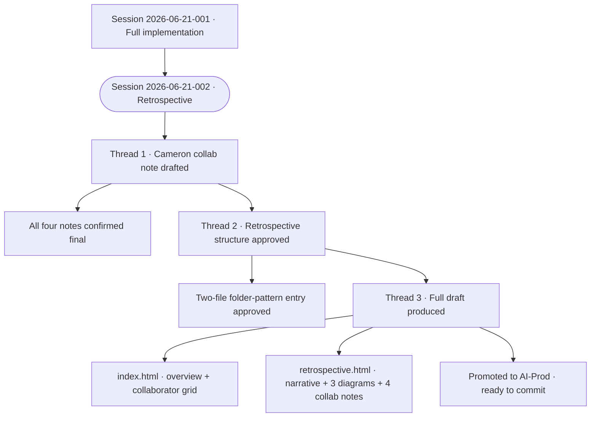

# Session Audit Log — 2026-06-21-002

---

## Metadata

| Field | Value |
|-------|-------|
| Session ID | 2026-06-21-002 |
| Date | 2026-06-21 |
| Participants | Cameron Loudon + Cowork (Claude, Anthropic) |
| Model | claude-sonnet-4-6 |
| Platform | Claude Cowork |
| Duration | ~1.5 hours (estimated) |
| Threads | 3 |
| Contradictions named | 0 |
| Resolved | 3 |
| Unresolved | 0 |
| Files produced | 4 |

**Tags:** `#retrospective` `#rct` `#ideas` `#four-collaborators` `#collab-note` `#session-log`

**Documents produced:**
- `_ideas/the-bug-the-audit-the-blueprint/index.html` — overview page
- `_ideas/the-bug-the-audit-the-blueprint/retrospective.html` — full narrative + all four collab notes
- `_session-logs/session-2026-06-21-002.md` — this file
- `PROJECT_STATE.md` — updated

**Prior sessions referenced:** session-2026-06-21-001

**Published pages connected:** `/ideas/the-bug-the-audit-the-blueprint/` and `/ideas/the-bug-the-audit-the-blueprint/retrospective/`

---

## Thread 1 — Cameron's Collaboration Note

**Where it went:**
Session picked up after context compaction. All four collaborator notes were in hand: Cowork's, Claude Code's, DeepSeek's (received prior session), and Cameron's note still to be drafted. DeepSeek's note had been assessed as excellent — particularly the observation about the bias being compensated for rather than eliminated, and the honest flag about having co-designed the controls it later audited.

Cameron's note was drafted in this session. Key framings confirmed:
- Cameron is not technical — stated plainly
- His role was to hold the goal and navigate between three AIs he didn't always fully understand
- He made calls when the three disagreed and set the hard constraints
- The cold-start test passing is the result that mattered

**Decision made:** Cameron's note stands as drafted. All four notes confirmed as final.

---

## Thread 2 — Retrospective Structure Approved

**Where it went:**
Before writing, the structure was proposed to Cameron for approval: two files — an overview index page and a full retrospective page — under `_ideas/the-bug-the-audit-the-blueprint/` as a folder-pattern entry (consistent with the man-with-two-brains reference implementation).

Retrospective structure: four parts (The Bug / The Audit / The Blueprint / The Build) → the honest close → all four collab notes reproduced verbatim.

Cameron approved with a single word.

---

## Thread 3 — Full Draft Produced and Promoted

**Where it went:**
Both files drafted and written to AI-Working/Projects/the-bug-the-audit-the-blueprint/. Content includes:

- **index.html:** 2×2 collaborator card grid, project summary, link to retrospective
- **retrospective.html:** Full four-part narrative, three Mermaid diagrams (review cycle, four-collaborator workflow, file architecture, Gantt timeline), honest close quoting Claude Code's "It is not self-maintaining", all four collaboration notes reproduced verbatim including Claude Code's two self-corrections to its attribution prompt

Files promoted to AI-Prod/_ideas/the-bug-the-audit-the-blueprint/. PROJECT_STATE.md updated. Session log written. Claude Code commit prompt produced.

**One thing deliberately not expanded:** The ai-content-creation-spec.md reconciliation work (the extended DeepSeek working session) was flagged as a potential addition to the Part Four narrative. Cameron did not request it — left out.

---

## Artifacts Produced This Session

| Artifact | Status | Location |
|----------|--------|----------|
| the-bug-the-audit-the-blueprint/index.html | Promoted to AI-Prod | `_ideas/the-bug-the-audit-the-blueprint/` |
| the-bug-the-audit-the-blueprint/retrospective.html | Promoted to AI-Prod | `_ideas/the-bug-the-audit-the-blueprint/` |
| session-2026-06-21-002.md | Complete | `_session-logs/` |
| PROJECT_STATE.md | Updated | repo root |

---

## Session Diagram

---

  
🤝 Collaboration Note

  

    
This session log was drafted by Cowork (Claude, Anthropic).

    
Model: claude-sonnet-4-6 · Session: 2026-06-21-002 · Platform: Cowork · Date: 2026-06-21

    
Cowork drafted all files in this session. Cameron approved the retrospective structure, confirmed Cameron's collaboration note as final, and approved publication. Claude Code will validate and commit via the prompt provided at end of session.

    
Reviewed and approved by Cameron Loudon. Part of the <a href="/approach/">Radical Collaboration Transparency</a> framework.

  

*Session conducted under the Radical Collaboration Transparency framework.*
*Model: claude-sonnet-4-6 · Session ID: 2026-06-21-002 · Platform: Cowork*
*Reviewed and approved by Cameron Loudon.*
